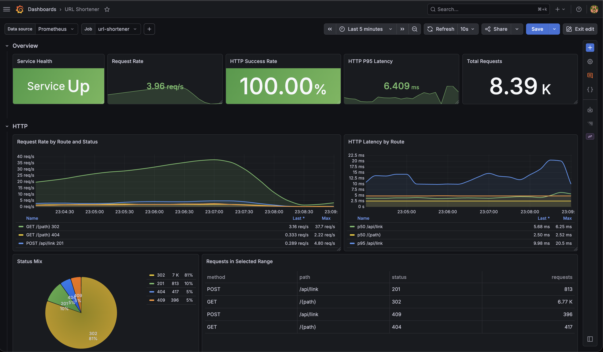

# Template Project - URL Shortener

This repository is a small Go URL shortener built as an example project template for other web based Go projects. 

This is not intended to be a production-grade API. It is deliberately small in scope and leaves out a number of production concerns such as authentication, rate limiting, observability, hardened configuration, and more complete API documentation.

## What It Does
The current sample code is a simple URL shortener that supports two endpoints:
- Create a short link via `POST /api/link`
- Redirect short link via `GET /{path}`

## Why This Project Exists
The goal of the project is to act as a simple Go project template that can easily be expanded into a larger project.

That includes:
- Robust web API boilerplate with strict request/response typing and graceful shutdown behaviour.
- Light HTTP handlers focused on request/response concerns.
- Separation between HTTP, business, and data access layers.
- Abstracting underlying store logic behind a store interface.
- Testing Approaches:
  - Simple unit tests.
  - Database-backed integration testing with `testcontainers-go`. 
- Simple CI pipeline.
- Local development with a simple out of the box Docker setup.
- Multi stage docker image build for small final image size with a narrow attack surface.

## Project Structure
```text
cmd/
  main.go                    Application entrypoint

api/
  api.go                     API bootstrap
  routes.go                  Route registration
  links/                     Link HTTP handlers and API facing models
  tests/                     API integration tests

internal/
  business/links/            Business logic and store abstraction
  business/links/pgstore/    Postgres-backed store implementation
  database/                  sqlc-generated query layer and DB helpers
  web/                       Request/response helpers and middleware
  logging/                   Logger setup

configs/
  database/                  Schema, sqlc config, query definitions
  docker/                    Docker setup
  /*                         Various configuration files required for observability
```


## Running Locally
Examples using `task`:

```bash
# API at localhost:8080
# Internal debug router at localhost:4040
task docker-compose-up 
```
Then run API requests in the [postman collection](.resources/postman/collection.json)

Useful commands:

```bash
task sqlc  # generate Go files for database interaction
task test  # test, golangci-lint, govulncheck
task testv # same as above --verbose
task build # build docker image

# Migration commands
task db-inspect # extract DB schema to file
task db-migrate # apply schema file to DB
```


## Observability
Docker Compose has been set up with a fairly standard observability stack with fully declaritively defined and provisioned dashboards, intended to just work out of the box.




## Tooling
This project currently uses:
- Go
- Docker / Docker Compose
- [sqlc](https://github.com/sqlc-dev/sqlc)
- [air](https://github.com/air-verse/air) - for development hot reloading
- [Atlas](https://atlasgo.io/docs)
- [Task](https://taskfile.dev/)
- Postgres
- GitHub Actions


## Possible Future Work
#### Application
- [x] Integration tests
- [ ] Custom validator error messages
- [x] Centralised middleware for error handling
- [x] Sensible automatic short path generation

#### Other / Misc
- [x] Run golangci-lint - Also run as a CI stage
- [x] Security scanning in pipeline
- [x] Observability and monitoring stack
  - [x] Grafana
  - [x] Prometheus - Metrics
  - [ ] Loki (with promtail) - Logging
  - [ ] Tempo - Tracing
  - [ ] K6 - Synthetic load 

- [ ] K3D - local Kubernetes

